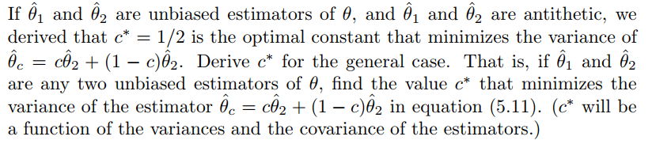
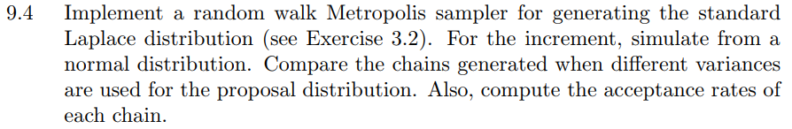

# Overview
In this file, all my homework answers are listed in the time order.

# HW0-2020-09-22

## Question 1
A graph

## Answer 1
Hello, this is my first R markdown document!

The figure is from the book *R for beginners* in page 49, which is shown as follows:


## Question 2
Including Tables

## Answer 2
Here is a table input, which is from the iris dataset:

```{r cars, echo=FALSE}
knitr::kable(head(iris), format = "html")
summary(cars)
```

And this table is from the **mtcars** dataset:
```{r, echo=FALSE}
knitr::kable(mtcars)
```

## Question 3
Latex Formulas

## Answer 3
The set of formulas is from the book **Statistical Computing with R** in Page.25, which lists the *properties of expected values and variance*:

\begin{equation}
1. E[ {aX + b} ] = aE[ X ] + b
\end{equation}

\begin{equation}
2. E[X + Y] = E[X] + E[Y] 
\end{equation}

\begin{equation}
3. Var[aX + b] = a^2Var(X) 
\end{equation}


\begin{equation}
4. Var(X + Y) = Var(X) + Var(Y) + 2Cov(X, Y)
\end{equation}

#### 5. If X and Y are independent, then 
\begin{align*}
Var(X + Y) &= Var(X) + Var(Y) \\
E[XY] &= E[X]E[Y]
\end{align*}


# HW1-2020-09-22
## Question 1


## Answer 1
Firstly, we get the inverse function $F^{-1}(x)$ as follows:

Suppose $y=F(x)$, then there is
\begin{equation}
y = 1 - {\left( {\frac{b}{x}} \right)^a}
\end{equation}


We assume that
\begin{equation}
x = 1 - {\left( {\frac{b}{y}} \right)^a}
\end{equation}

and we get

\begin{equation}
y = \frac{b}{{\sqrt[a]{{1 - x}}}}
\end{equation}

Therefore,

\begin{equation}
{F^{ - 1}}\left( x \right) = \frac{b}{{\sqrt[a]{{1 - x}}}}
\end{equation}

When $a=2$ and $b=2$, we get the sample ($n=10000$) in the following:

```{r 11, echo=FALSE}
set.seed(12345)
n <- 10000
u <- runif(n)
x <- 2*(1-u)^{-0.5} # F(x) = x^3, 0<=x<=1

hist(x, prob = TRUE, main = expression(f(x)==1-(2/x)^2))
y <- seq(1, 10000)
lines(y, 1-(2*y^(-1))^2)
```

## Question 2


## Answer 2

Suppose the function that generates random variates from $f_e$ is $F(x_1,x_2,x_3)$.

Suppose iid $x_1$, $x_2$, $x_3$ ~ $Uniform(-1,1)$, and we define the $F(x_1,x_2,x_3)$ as:

\begin{equation}
F({x_1},{x_2},{x_3}) = \left\{ {\begin{array}{*{20}{c}}
{{x_2},}&{\left| {{x_3}} \right| \ge \left| {{x_2}} \right|and\left| {{x_3}} \right| \ge \left| {{x_1}} \right|}\\
{{x_3},}&{otherwise}
\end{array}} \right.
\end{equation}

Then we get a large simulated random sample where $n=10000$:

```{r 12, echo=FALSE}
  a <- list()
  set.seed(12345)
  n <- 10000
  u1 <- runif(n,-1,1)
  
  u2 <- runif(n,-1,1)
  
  u3 <- runif(n,-1,1)
  
for (i in 1:10000){
  x1 <- u1[i] # F(x) = x^3, 0<=x<=1
  x2 <- u2[i]
  x3 <- u3[i]
  a[i]=ifelse(abs(x3)>abs(x2)&&abs(x3)>abs(x1),x2,x3)
}
  
x <- as.numeric(a)

hist(x, prob = TRUE)

```

## Question 3


## Answer 3

The CDF of $f_e$ is:


\begin{equation}
\begin{array}{c}
F(x) = \int_{ - \infty }^x {{f_e}\left( x \right)dx} \\
 = \frac{3}{4}x - \frac{{{x^3}}}{4}
\end{array}
\end{equation}


The comparision is shown in the following:

```{r 13, echo=FALSE}
  a <- list()
  set.seed(12345)
  n <- 10000
  u1 <- runif(n,-1,1)
  
  u2 <- runif(n,-1,1)
  
  u3 <- runif(n,-1,1)
  
for (i in 1:10000){
  x1 <- u1[i] # F(x) = x^3, 0<=x<=1
  x2 <- u2[i]
  x3 <- u3[i]
  a[i]=ifelse(abs(x3)>abs(x2)&&abs(x3)>abs(x1),x2,x3)
}
  
x <- as.numeric(a)

hist(x, prob = TRUE, main = expression(F(x)==3*x/4-x^3/4))

y <- seq(-1,1,.00001)
lines(y, 3*y/4-y^3/4)

```

## Question 4


## Answer 4

Firstly, we get the inverse function $F^{-1}(x)$ as follows:

\begin{equation}
{F^{ - 1}}(x) = \frac{\beta }{{{{(1 - x)}^{\frac{1}{r}}}}} - \beta 
\end{equation}

We construct the the histogram density estimate of $f_e$ where $n=10000$ in the following:

```{r 14, echo=FALSE}
n <- 1000
u <- runif(n)
x <- 2*(1-u)^(-1/4)-2 # F(x) = x^3, 0<=x<=1
hist(x, prob = TRUE, main = expression(f(x)==1-(2/(2+x))^{4}))
y <- seq(0,1,0.001)
lines(y, 1-(2/(2+y))^4)
```

# HW2-2020-10-13
## Question 1


## Answer 1

$$
\int_{0}^{\frac{\pi}{3}}{\sin tdt}  = \int_{0}^{\frac{\pi}{3}} {g(t)\frac{1}{{{\frac{\pi}{3}} - 0}}dt} 
$$

 
where
$$
\begin{array}{c}
g(t) = ({\frac{\pi}{3}} - 0)\sin t \\
 = \frac{\pi }{3}\sin t
\end{array}
$$


 
Therefore, 
\begin{equation}
\int_{0}^{\frac{\pi}{3}}{\sin tdt}  = \frac{\pi }{3}E(\sin X)
\end{equation}

where

$$ X \sim U (0,\frac{\pi }{3}) $$

And the original value of the integral is:

$$
\int_0^{\frac{\pi }{3}} {\sin tdt}  =  - \cos x\left| {\begin{array}{*{20}{c}}
{\frac{\pi }{3}}\\
0
\end{array}} \right.
$$

```{r 21}
n <- 1e5 
x <- runif(n, min=0, max=pi/3)
th <- mean(sin(x)) * pi/3
print(c(th,1-cos(pi/3)))

```

## Question 2


## Answer 2

The original estimator is:

$$
\theta  = \int_0^1 {{e^x}dx}  = E\left( {{e^X}} \right)

$$

where

$$
X \sim U(0,1)
$$

The antithetic variable estimator is:

$$
\theta ' = \frac{1}{n}\sum\limits_{i = 1}^{\frac{n}{2}} {\left( {{e^{{X_i}}} + {e^{\left( {{\rm{1 - }}{X_i}} \right)}}} \right)} 
$$
where

$$
X \sim U(0,1)
$$

Therefore, the original value's variance and the antithetic variable estimator's variance is:

```{r 22}
MC.Phi <- function(x, R = 10000, antithetic = TRUE) {
  u <- runif(R/2,0,x)
  if (!antithetic) v <- runif(R/2,0,x) else v <- 1 - u
  g <- exp(u)+exp(v)
  cdf <- mean(g) 
  cdf
}

m <- 1000
MC1 <- MC2 <- numeric(m)
x <- 1

for (i in 1:m) {
  MC1[i] <- MC.Phi(x, R = 1000, anti = FALSE)
  MC2[i] <- MC.Phi(x, R = 1000)
}


print(c(var(MC1),var(MC2),1-var(MC2)/var(MC1)))

```

The theoretical value is:


```{r 23}


m <- 1000
MC1 <- MC2 <- MC3 <- MC4 <- numeric(m)
x <- 1

for (i in 1:m) {
  u <- runif(1000,0,1)
  MC1[i] <- mean(exp(u))
  v <- 1-u
  MC2[i] <- mean(exp(v))
  MC4[i] <- mean(u)
}


print(c(var(MC1+MC2),cov(MC1,MC2)))

ves <- var(MC1)-cov(MC1,MC4)^2/var(MC4)

print(c(ves,var(MC1),1-ves/var(MC1)))


```


## Question 3




## Answer 3

The function of $c$ is:


$$
f(c) = Var({\hat \theta _2}) + {c^2}Var({\hat \theta _1} - {\hat \theta _2}) + 2cCov({\hat \theta _2},{\hat \theta _1} - {\hat \theta _2})
$$

The optimal value is derived from $f'(c)=0$, which is:

$$
f'(c) = 2cVar({\hat \theta _1} - {\hat \theta _2}) + 2Cov({\hat \theta _2},{\hat \theta _1} - {\hat \theta _2}) = 0
$$

i.e.

$$
c =  - \frac{{Cov({{\hat \theta }_2},{{\hat \theta }_1} - {{\hat \theta }_2})}}{{Var({{\hat \theta }_1} - {{\hat \theta }_2})}}
$$

# HW3-2020-10-20
## Question 1


## Answer 1

Suppose ${f_1}\left( x \right) = \frac{1}{{\sqrt {2\pi } }}{e^{ - \frac{{{x^2}}}{2}}}$ and ${f_2}\left( x \right) = {e^{ - x}}$, and their respective variances when serving as the important functions are listed in the follows:

```{r 31}
m <- 10000
theta.hat <- se <- numeric(2)
g <- function(x) {
exp(-x^2/2)*(x^2)*(2*pi)^(-0.5) 
}

x1 <- rnorm(m,0,1) #using f1
fg <- g(x1) / dnorm(x1)
theta.hat[1] <- mean(fg)
se[1] <- var(fg)

x2 <- rexp(m, 1) #using f1
fg <- g(x2) / exp(-x2)
theta.hat[2] <- mean(fg)
se[2] <- var(fg)

y <- seq(1, 5, .01)
s1 <- dnorm(y,0,1)
s2 <- exp(-y)
s3 <- g(y)


plot(y,s3,col="green",xlim=c(1,5),ylim=c(0,0.4),type='l',
     xaxs="i", yaxs="i",ylab='density',xlab='',
     main="三个函数对比")

lines(y,s1,col="DarkTurquoise")#lty=1表示用实线连起来

lines(y,s2,col="DeepPink")#lty=2表示用虚线连起来
legend.text=c(expression(paste("g(x)")),
expression(paste("f1(x)")),
expression(paste("f2(x)")))

legend("topright",legend=legend.text,
       lwd=1,col=c("green","DarkTurquoise","DeepPink"),bty='n')


print(paste("The estimate of function 1 is: ",theta.hat[1]," and its variance is: ",se[1]))
print(paste("The estimate of function 2 is: ",theta.hat[2]," and its variance is: ",se[2]))

rbind(theta.hat, se)
```

Therefore, the function ${f_2}\left( x \right) = {e^{ - x}}$ produces a smaller variance as the importance function.


## Question 2


## Answer 2
The stratified importance sampling estimate in Example 5.13 is: 
```{r 32}
M <- 10000
k <- 5 # what if k is larger?
N <- 50 #number of times to repeat the estimation
T2 <- numeric(k)
est <- matrix(0, N, 2)
f <-function(x) {
  5* exp(-x)/(1-exp(-1))
}
g <-function(x){
  exp(-x)/(1+x^2)
}


for (i in 1:N) {
u <- runif(M) #f3, inverse transform method
x <- - log(1-u * (1 - exp(-1)))
fg <- g(x) / (exp(-x) / (1 - exp(-1)))
est[i, 1] <- mean(fg)

for(j in 1:k) {
  u2 <- runif(M/k,(j-1)/k,j/k)
  x2 <- -log(1-(u2 * (1 - exp(-1)))/5)
  T2[j]<-mean(g(x2)/f(x2)) #the mean of each strata
}

est[i, 2] <- mean(T2)
}

est
apply(est,2,mean)
apply(est,2,sd)

```

## Question 3


## Answer 3
Given that $\ln X \sim N\left( {\mu ,{\delta ^2}} \right)$ and $\alpha  = 0.05$ , suppose $Y=\ln X$ and 
$T = \frac{{\bar Y - \mu }}{ {{S_n^*} / {\sqrt n }}}  \sim t\left( {n - 1} \right)$.

Since 

$$ P\left\{ {\left| T \right| \le {t_{\frac{\alpha }{2}}}\left( {n - 1} \right)} \right\} = 1 - \alpha, $$
\begin{equation}

\left| T \right| \le {t_{\frac{\alpha }{2}}}\left( {n - 1} \right) \Leftrightarrow \left| {\frac{{\bar Y - \mu }}{{{
  {{S_n^*} / {\sqrt n }}} }}} \right| \le {t_{\frac{\alpha }{2}}}\left( {n - 1} \right),

\end{equation}

therefore, the 95% CI for parameter $\mu$ is: 
$$\bar Y - \frac{{S_n^*}}{{\sqrt n }}{t_{\frac{\alpha }{2}}}\left( {n - 1} \right) \le \mu  \le \bar Y + \frac{{S_n^*}}{{\sqrt n }}{t_{\frac{\alpha }{2}}}\left( {n - 1} \right),$$

where
$$
\bar Y = \frac{1}{n}\sum\limits_{i = 1}^n {\ln {X_i}}
$$
and 

\begin{equation}
\begin{aligned}
S_n^* & = \sqrt {\frac{1}{{n - 1}}\sum\limits_{i = 1}^n {{{\left( {{Y_i} - \bar Y} \right)}^2}} } \\
 & = \sqrt {\frac{1}{{n - 1}}\sum\limits_{i = 1}^n {{{\left( {\ln {X_i} - \frac{1}{n}\sum\limits_{i = 1}^n {\ln {X_i}} } \right)}^2}} } .
\end{aligned}
\end{equation}

## Question 4


## Answer 4
The MC estimate of the interval of ECP is:

```{r 34}
n <- 20
alpha <- .05
UCL <- replicate(1000, expr = {
x <- rchisq(n, df = 2)
mu <- 2
abs((mean(x)-mu)/(sd(x)/(n-1)^(0.5)))
} )
sum(UCL <= qt(1-alpha/2,df = n-1))

mean(UCL <= qt(1-alpha/2,df = n-1))

```

Therefore, its ECP is much larger than that in Example 6.4.

# HW4-2020-10-27
## Question 1


### Beta分布用偏度检验正态性
```{r 41}
#compute the sample skewness statistic
sk <- function(x) {
#computes the sample skewness coeff.
xbar <- mean(x)
m3 <- mean((x - xbar)^3)
m2 <- mean((x - xbar)^2)
return( m3 / m2^1.5 )
}

#power test
n <- 30
m <- 1000
mu0 <- 500
sigma <- c(100,80,40,20,10,5,2)
mu <- c(100,80,40,20,10,5,2) #alternatives
M <- length(mu)
power <- numeric(M)
cv <- qnorm(0.95,0,sqrt(6/n))
for (i in 1:M) {
mu1 <- mu[i]
sig <- sigma[i]
#simulate under alternative mu1

#n is a vector of sample sizes
sktests <- numeric(m) #test decisions
for (j in 1:m) {
#test decision is 1 (reject) or 0
x <- rbeta(n, mu1, sig)
sktests[j] <- as.integer(abs(sk(x)) >= cv )
}
power[i] <- mean(sktests) #proportion rejected
}

rbind(sigma, power)
```

#### As the results above shows, the bigger $\alpha$ and $\beta$ are, the Beta distribution is of more normality. To be more specific, when $\alpha \leq 20$, it is far from normality.

### t分布用偏度检验正态性

```{r tst}
#compute the sample skewness statistic
sk <- function(x) {
#computes the sample skewness coeff.
xbar <- mean(x)
m3 <- mean((x - xbar)^3)
m2 <- mean((x - xbar)^2)
return( m3 / m2^1.5 )
}

#power test
n <- 30
m <- 1000
df<- c(100,80,40,20,10,5,2) #alternatives
M <- length(df)
power <- numeric(M)
cv <- qnorm(0.95,0,sqrt(6/n))
for (i in 1:M) {
df1 <- df[i]

#simulate under alternative mu1

#n is a vector of sample sizes
sktests <- numeric(m) #test decisions
for (j in 1:m) {
#test decision is 1 (reject) or 0
x <- rt(n,df1)
sktests[j] <- as.integer(abs(sk(x)) >= cv )
}
power[i] <- mean(sktests) #proportion rejected
}

rbind(df,power)

```
#### Compared with Beta distribution, the T distribution is of more normality, which is more and more normal as the degree of freedom slumps.

## Question 2


## Answer 2

#### The Count Five Test is:
```{r MC five tes}
count5test <- function(x, y) {
X <- x - mean(x)
Y <- y - mean(y)
outx <- sum(X > max(Y)) + sum(X < min(Y))
outy <- sum(Y > max(X)) + sum(Y < min(X))
# return 1 (reject) or 0 (do not reject H0)
return(as.integer(max(c(outx, outy)) > 5))
}
n1 <- n2 <- c(100,50,20)
n <- 3
mu1 <- mu2 <- 0
sigma1 <- 1
sigma2 <- 1.5
m <- 1000
# generate samples under H0
pr <- numeric(n)
for (i in n){
  power<- numeric(m)
  for (j in m){
  x <- rnorm(n1[i], mu1, sigma1)
  y <- rnorm(n2[i], mu2, sigma2)  
  power[j] <- count5test(x, y)
  }
  pr[i] <- mean(power)
}


pr

rbind(n1,pr)
```

#### The F Test is:
```{r F tes}
Ftest <- function(x, y) {
X <- sd(x)
Y <- sd(y)
n <- length(x)-1
m <- length(y)-1
f1 <- as.integer(X/Y < qf(0.055/2, n, m))
f2 <- as.integer(X/Y > qf(1-0.055/2, n, m))
# return 1 (reject) or 0 (do not reject H0)
return(max(f1,f2))
}

n1 <- n2 <- c(100,50,20)
mu1 <- mu2 <- 0
sigma1 <- 0
sigma2 <- 1.5
m <- 1000
n <- 3
fpr <- numeric(n)
# generate samples under H0
for (i in n){
  fpower<- numeric(m)
  for (j in m){
  x <- rnorm(n1[i], mu1, sigma1)
  y <- rnorm(n2[i], mu2, sigma2)  
  fpower[j] <- Ftest(x, y)
  }
  fpr[i] <- mean(fpower)
}


fpr
rbind(n1,fpr)

```

#### As the results have suggested, the results of the two tests are all the same when the sample size is large. And F test is more precise when the sample size is small.

## Question 3


## Answer 3
#### The Example 6.8 for multivariate skewness test is:
```{r 43}
sk <- function(m,nv) {
  beta <- numeric(1000)
  mu <- numeric(nv)
  for (j in 1:1000) {
  mu <- numeric(2)
  x <- rnorm(m)
  y <- rnorm(m)
  mu[1] <- mean(x)
  mu[2] <- mean(y)
  cxy <- solve(cov(x,y))
  X <- cbind(x,y)
  beta[i]<-(t(X[1]-mu[1])%*%cxy%*%(X[2]-mu[2]))^3
  }
  
#computes the sample skewness coeff.
#
return( sum(beta)/1000^2)
}
nv <- 2
n <- c(10, 20, 30, 50, 100, 500) #sample sizes
 #crit. values for each n
#n is a vector of sample sizes
#we are doing length(n) different simulations
p.reject <- numeric(length(n)) #to store sim. results
m <- 10000 #num. repl. each sim.
for (i in 1:length(n)) {
 #test decisions
sktests <- numeric(m)
#test decision is 1 (reject) or 0
cv1 <- qchisq(.975,n[i]*(n[i]+1)*(n[i]+2)/6)
cv2 <- qchisq(.025,n[i]*(n[i]+1)*(n[i]+2)/6)
for (j in m){
s <- sk(n[i],nv)*n[i]/6
s1 <- as.integer(abs(s) >= cv1)
s2 <- as.integer(abs(s) <= cv2)
sktests[j] <- max(s1,s2)
}
p.reject[i] <- mean(sktests) #proportion rejected
}

rbind(n,p.reject)
```

#### The Example 6.10 for multivariate skewness test is:
```{r ex6.10}
sk2 <- function(n,sigma) {
  beta <- numeric(1000)
  mu <- numeric(2)
  for (j in 1:1000) {
  mu <- numeric(2)
  x <- rnorm(n, 0, sigma)
  y <- rnorm(n, 0, sigma)
  mu[1] <- mean(x)
  mu[2] <- mean(y)
  cxy <- solve(cov(x,y))
  X <- cbind(x,y)
  beta[i]<-(t(X[1]-mu[1])%*%cxy%*%(X[2]-mu[2]))^3
  }
  
#computes the sample skewness coeff.
#
return( sum(beta)/1000^2)
}


alpha <- .1
n <- 30
m <- 1000
epsilon <- c(0, .15, .01, 1, .05)
N <- length(epsilon)
pwr <- numeric(N)
#critical value for the skewness test
cv1 <- qchisq(.975,n*(n+1)*(n+2)/6)
cv2 <- qchisq(.025,n*(n+1)*(n+2)/6)
for (j in 1:N) { #for each epsilon
e <- epsilon[j]
sktests <- numeric(m)
for (i in 1:m) { #for each replicate
sigma <- sample(c(1, 10), replace = TRUE,
size = 1, prob = c(1-e, e))
s <- sk2(n,sigma)*n/6
s1 <- as.integer(abs(s) >= cv1)
s2 <- as.integer(abs(s) <= cv2)
sktests[i] <- max(s1,s2)
}
pwr[j] <- mean(sktests)
}
#plot power vs epsilon
plot(epsilon, pwr, type = "b",
xlab = bquote(epsilon), ylim = c(0,1))
abline(h = .1, lty = 3)
se <- sqrt(pwr * (1-pwr) / m) #add standard errors
lines(epsilon, pwr+se, lty = 3)
lines(epsilon, pwr-se, lty = 3)

rbind(epsilon,pwr)
```
## Question 4


## Answer 4
#### 1
The corresponding hypothesis is $H_0:power_1=power_2$.

#### 2
We need to use paired-t test because the two power statistics are derived from the same population.

#### 3
We need to know the degree of freedom.


# HW5-2020-11-03
## Question 1


## Answer 1
```{r 51}
set.seed(12345)
library(bootstrap) #for the law data
data(law, package = "bootstrap")
#data(law82, package = "bootstrap")
rcor <- function(i)
{
  LSAT <- law$LSAT[i] #i is a vector of indices
  GPA <- law$GPA[i]
  return(cor(LSAT,GPA))
}
B <- 200 #number of replicates
n <- nrow(law) #sample size
R <- numeric(n) #storage for replicates
theta.hat <- rcor(1:n)
print(theta.hat)

#set up the jackniffe
for (b in 1:n) {
#randomly select the indices
R[b] <- rcor((1:n)[-b])
}
#compute the bias of r
bias.jack <- (n-1)*(mean(R)-theta.hat)
#compute the standard error of r
se.jack <- sqrt((n-1)*mean((R-theta.hat)^2))
round(c(original=theta.hat,bias.jack=bias.jack,
se.jack=se.jack),3)


```


## Question 2


## Answer 2
```{r 52}
set.seed(12345)
library(boot)
data(aircondit,package ="boot")
jx<- c(3, 5, 7, 18, 43, 85, 91, 98,100, 130, 230,487)
n<- length(jx)
B<- 1000
mtime <- numeric(B)

#compute the MLE of lamda
f <- function(x,i){
   #g <- function(lamda) n*log(lamda) - lamda*sum(x)
   #1/optimize(g,c(0,1),maximum = TRUE)$maximum
   #return (logL)
  #llamda <- sum(x)/n #1/lamda
  mean(x)
}

#f(jx,1)

for(i in 1:B)
{
 xstar <- sample(jx,replace=TRUE)
 mtime[i] <- mean(xstar)
}

theta <- mean(mtime)
cat('1/lamda =',theta)
alpha<-0.05
ci.norm<-ci.basic<-ci.perc<-ci.bca<-matrix(NA,1,2)

#de <- boot(data=jx,statistic=f, R = 999)

#ci <- boot.ci(de,type=c("norm","basic","perc","bca"))

#ci$norm[2:3]
ci.norm[1,]<- c(theta+1*n^(-0.5)*qnorm(alpha/2,0,1),theta-1*n^(-0.5)*qnorm(alpha/2,0,1))
                
#qnorm((1-alpha)/2,0,1)
#qnorm(alpha/2,0,1)

cat("norm CI is: ",ci.norm)

#ci.basic[1,]<-ci$basic[4:5]
#ci.perc[1,]<-ci$percent[4:5]
#ci.bca[1,]<-ci$bca[4:5]

#rbind(ci.norm,ci.basic,ci.perc,ci.bca)

```

## Question 3


## Answer 3
```{r 53}
data(scor, package = "bootstrap")
n <- nrow(scor)
m <- ncol(scor)
R<-numeric(n)
theta.hat <- function(x)
{
  s <- cov(x)
  a.e=eigen(s,symmetric=T)$values
  y <- max(a.e)
  z <- sum(a.e)
  theta <- y / z
  return (theta)
}

theta <- theta.hat(scor)
#compute jackknife
for (b in 1:n) {
#randomly select the indices
R[b] <- theta.hat(scor[-b])
}

#compute the bias of r
bias.jack <- (n-1)*(mean(R)-theta)
#compute the standard error of r
se.jack <- sqrt((n-1)*mean((R-theta)^2))

round(c(original=theta,bias.jack=bias.jack,
se.jack=se.jack),3)

```

## Question 4


## Answer 4
```{r 54}
library(DAAG)
attach(ironslag)
a <- seq(10, 40, .1) #sequence for plotting fits
#fitting four models
L1 <- lm(magnetic ~ chemical) #Fitting Linear Models
plot(chemical, magnetic, main="Linear", pch=16)
yhat1 <- L1$coef[1] + L1$coef[2] * a
lines(a, yhat1, lwd=2)

L2 <- lm(magnetic ~ chemical + I(chemical^2))
plot(chemical, magnetic, main="Quadratic", pch=16)
yhat2 <- L2$coef[1] + L2$coef[2] * a + L2$coef[3] * a^2
lines(a, yhat2, lwd=2)

L3 <- lm(log(magnetic) ~ chemical)
plot(chemical, magnetic, main="Exponential", pch=16)
logyhat3 <- L3$coef[1] + L3$coef[2] * a
yhat3 <- exp(logyhat3)
lines(a, yhat3, lwd=2)

L4 <- lm(log(magnetic) ~ log(chemical))
plot(log(chemical), log(magnetic), main="Log-Log", pch=16)
logyhat4 <- L4$coef[1] + L4$coef[2] * log(a)
lines(log(a), logyhat4, lwd=2)

#leave-one-out cross validation
n <- length(magnetic) #in DAAG ironslag
e1 <- e2 <- e3 <- e4 <- numeric(n)
# for n-fold cross validation
# fit models on leave-one-out samples
for (k in 1:n) {
y <- magnetic[-k]
x <- chemical[-k]
J1 <- lm(y ~ x)
yhat1 <- J1$coef[1] + J1$coef[2] * chemical[k]
e1[k] <- magnetic[k] - yhat1

J2 <- lm(y ~ x + I(x^2))
yhat2 <- J2$coef[1] + J2$coef[2] * chemical[k] +
J2$coef[3] * chemical[k]^2
e2[k] <- magnetic[k] - yhat2

J3 <- lm(log(y) ~ x)
logyhat3 <- J3$coef[1] + J3$coef[2] * chemical[k]
yhat3 <- exp(logyhat3)
e3[k] <- magnetic[k] - yhat3

J4 <- lm(log(y) ~ log(x))
logyhat4 <- J4$coef[1] + J4$coef[2] * log(chemical[k])
yhat4 <- exp(logyhat4)
e4[k] <- magnetic[k] - yhat4
}

c(mean(e1^2), mean(e2^2), mean(e3^2), mean(e4^2))

#leave-two-out cross validation
er1 <- er2 <- er3 <- er4 <- matrix(0,n,n)
for (k in 1:n) {
y <- magnetic[-k]
x <- chemical[-k]
  for (g in 1:(n-1))
{
    yg <- y[-g]
    xg <- x[-g]
    
    G1 <- lm(yg ~ xg)
    yhat11 <- G1$coef[1] + G1$coef[2] * chemical[k]
    yhat12 <- G1$coef[1] + G1$coef[2] * x[g]
    er1[k,g] <- (magnetic[k] - yhat11+y[g] - yhat12)/2
    
    
    G2 <- lm(yg ~ xg + I(xg^2))
    yhat21 <- G2$coef[1] + G2$coef[2] * chemical[k] +
    G2$coef[3] * chemical[k]^2
    yhat22 <- G2$coef[1] + G2$coef[2] * x[g] +
    G2$coef[3] * x[g]^2
    er2[k,g] <- (magnetic[k] - yhat21+y[g] - yhat22)/2
    
    G3 <- lm(log(yg) ~ xg)
    logyhat31 <- G3$coef[1] + G3$coef[2] * chemical[k]
    yhat31 <- exp(logyhat31)
    logyhat32 <- G3$coef[1] + G3$coef[2] * x[g]
    yhat32 <- exp(logyhat32)
    er3[k,g] <- (magnetic[k] - yhat31+y[g]- yhat32)/2

    G4 <- lm(log(yg) ~ log(xg))
    logyhat41 <- G4$coef[1] + G4$coef[2] * log(chemical[k])
    yhat41 <- exp(logyhat41)
    logyhat42 <- G4$coef[1] + G4$coef[2] * log(x[g])
    yhat42 <- exp(logyhat42)
    er4[k,g] <- (magnetic[k] - yhat41+y[g]- yhat42)/2
  }

}

cat("The one-leave-out cross validation result is: ",c(mean(e1^2), mean(e2^2), mean(e3^2), mean(e4^2)))

cat("The two-leave-out cross validation result is: ",c(mean(er1^2), mean(er2^2), mean(er3^2), mean(er4^2)))


```

It demonstrates that Model 2, the quadratic model,
still be the best fit for the data.


# HW6-2020-11-10
## Question 1


## Answer 1

```{r 61 t test}
library(RANN)
library(boot)
library(energy)
set.seed(12345)

n1 <- 20
n2 <- 30
mu1 <- mu2 <- 0
sigma1 <- sigma2 <- 1
m <- 10000
alphahat <- mean(replicate(m, expr={
x <- rnorm(n1, mu1, sigma1)
y <- rnorm(n2, mu2, sigma2)
x <- x - mean(x) #centered by sample mean
y <- y - mean(y)
t.test(x,y)$p.value #count5test(x, y)#bd.test(x, y)
}))
cat("t test: ",alphahat)


#NN test
x <- rnorm(n1, mu1, sigma1)
y <- rnorm(n2, mu2, sigma2)
z <- c(x,y)
Tn <- function(z, ix, k) {
n <- n1 + n2
if(is.vector(z)) z <- data.frame(z,0);
z <- z[ix, ];
NN <- nn2(data=z, k=k+1) # what's the first column?
block1 <- NN$nn.idx[1:n1,-1]
block2 <- NN$nn.idx[(n1+1):n,-1]
i1 <- sum(block1 < n1 + .5);
i2 <- sum(block2 > n1+.5)
(i1 + i2) / (k * n)
}
boot.obj <- boot(data = z, statistic = Tn, R = 999,
sim = "permutation", k=3)
ts <- c(boot.obj$t0,boot.obj$t)
p.value <- mean(ts>=ts[1])
cat("NN test: ",p.value)

#energy
x <- rnorm(n1, mu1, sigma1)
y <- rnorm(n2, mu2, sigma2)
z <- c(x, y)
N <- c(length(x), length(y))
cat("Energy test: ", eqdist.etest(z, sizes=N, R=m)$p.value)

```

## Question 2


```{r 62}
#Unequal variances and equal expectations

set.seed(12345)
library(Ball)
library(boot)
library(energy)
library(RANN)
n1 <- 50
n2 <- 50
mu1 <- mu2 <- 0
sigma1 <- 1.4
sigma2 <- 1
m <- 1000
alpha <- 0.05
B <- 100
pvalue <- matrix(0,3,B)
power <- numeric(3)

Tn <- function(z, ix, k) {
n <- n1 + n2
if(is.vector(z)) z <- data.frame(z,0)
z <- z[ix, ]
NN <- nn2(data=z, k=k+1) # what's the first column?
block1 <- NN$nn.idx[1:n1,-1]
block2 <- NN$nn.idx[(n1+1):n,-1]
i1 <- sum(block1 < n1 + .5)
i2 <- sum(block2 > n1+.5)
(i1 + i2) / (k * n)
}

for(i in 1:B)
{
  x <- rnorm(n1, mu1, sigma1)
  y <- rnorm(n2, mu2, sigma2)
  z <- c(x, y)
  boot.obj <- boot(data = z, statistic = Tn, R = m,
  sim = "permutation", k=3)
  ts <- c(boot.obj$t0,boot.obj$t)
  pvalue[1,i] <- mean(ts >= ts[1])
  boot.obs <- eqdist.etest(z, sizes=c(n1,n2), R=m)
  pvalue[2,i] <- boot.obs$p.value
  pvalue[3,i] = bd.test(x = x, y = y, R=m)$p.value
  #bd.test(x = x, y = y, R=m)
}
power1 <- mean(pvalue[1,] <= alpha)
power2 <- mean(pvalue[2,] <= alpha)
power3 <- mean(pvalue[3,] <= alpha)
cat("NN power is: ", power1)
cat("Energy power is: ", power2)
cat("Ball power is: ", power3)


```

```{r 63}
#Unequal variances and unequal expectations

set.seed(12345)
library(Ball)
library(boot)
library(energy)
library(RANN)
n1 <- 50
n2 <- 50
mu1 <- 0
mu2 <- 0.2
sigma1 <- 1.3
sigma2 <- 1
m <- 1000
alpha <- 0.05
B <- 100
pvalue <- matrix(0,3,B)
power <- numeric(3)

Tn <- function(z, ix, k) {
n <- n1 + n2
if(is.vector(z)) z <- data.frame(z,0)
z <- z[ix, ]
NN <- nn2(data=z, k=k+1) # what's the first column?
block1 <- NN$nn.idx[1:n1,-1]
block2 <- NN$nn.idx[(n1+1):n,-1]
i1 <- sum(block1 < n1 + .5)
i2 <- sum(block2 > n1+.5)
(i1 + i2) / (k * n)
}

for(i in 1:B)
{
  x <- rnorm(n1, mu1, sigma1)
  y <- rnorm(n2, mu2, sigma2)
  z <- c(x, y)
  boot.obj <- boot(data = z, statistic = Tn, R = m,
  sim = "permutation", k=3)
  ts <- c(boot.obj$t0,boot.obj$t)
  pvalue[1,i] <- mean(ts >= ts[1])
  boot.obs <- eqdist.etest(z, sizes=c(n1,n2), R=m)
  pvalue[2,i] <- boot.obs$p.value
  pvalue[3,i] = bd.test(x = x, y = y, R=m)$p.value
  #bd.test(x = x, y = y, R=m)
}
power1 <- mean(pvalue[1,] <= alpha)
power2 <- mean(pvalue[2,] <= alpha)
power3 <- mean(pvalue[3,] <= alpha)
cat("NN power is: ", power1)
cat("Energy power is: ", power2)
cat("Ball power is: ", power3)


```

```{r 64}
#Unnormal distributions

set.seed(12345)
library(Ball)
library(boot)
library(energy)
library(RANN)
n1 <- 100
n2 <- 100
df <- 1
m <- 1000
alpha <- 0.05
B <- 100
pvalue <- matrix(0,3,B)
power <- numeric(3)
mu1 <- 0
mu2 <- 0.2
sigma1 <- 1.3
sigma2 <- 1

Tn <- function(z, ix, k) {
n <- n1 + n2
if(is.vector(z)) z <- data.frame(z,0)
z <- z[ix, ]
NN <- nn2(data=z, k=k+1) # what's the first column?
block1 <- NN$nn.idx[1:n1,-1]
block2 <- NN$nn.idx[(n1+1):n,-1]
i1 <- sum(block1 < n1 + .5)
i2 <- sum(block2 > n1+.5)
(i1 + i2) / (k * n)
}

for(i in 1:B)
{
  x <- rt(n1, df)
  y <- c(rnorm(n2/2, mu1, sigma1),rnorm(n2/2, mu2, sigma2))
  z <- c(x, y)
  boot.obj <- boot(data = z, statistic = Tn, R = m,
  sim = "permutation", k=3)
  ts <- c(boot.obj$t0,boot.obj$t)
  pvalue[1,i] <- mean(ts >= ts[1])
  boot.obs <- eqdist.etest(z, sizes=c(n1,n2), R=m)
  pvalue[2,i] <- boot.obs$p.value
  pvalue[3,i] = bd.test(x = x, y = y, R=m)$p.value
  
}
power1 <- mean(pvalue[1,] <= alpha)
power2 <- mean(pvalue[2,] <= alpha)
power3 <- mean(pvalue[3,] <= alpha)
cat("NN power is: ", power1)
cat("Energy power is: ", power2)
cat("Ball power is: ", power3)


```

```{r 65}
#Unbalanced samples

set.seed(12345)
library(Ball)
library(boot)
library(energy)
library(RANN)
n1 <- 100
n2 <- 10
mu1 <- mu2 <- 0
sigma1 <- 1
sigma2 <- 1
m <- 1000
alpha <- 0.05
B <- 1000
pvalue <- matrix(0,3,B)
power <- numeric(3)

Tn <- function(z, ix, k) {
n <- n1 + n2
if(is.vector(z)) z <- data.frame(z,0)
z <- z[ix, ]
NN <- nn2(data=z, k=k+1) # what's the first column?
block1 <- NN$nn.idx[1:n1,-1]
block2 <- NN$nn.idx[(n1+1):n,-1]
i1 <- sum(block1 < n1 + .5)
i2 <- sum(block2 > n1+.5)
(i1 + i2) / (k * n)
}

for(i in 1:B)
{
  x <- c(rnorm(n2, mu1, sigma1),rt(n1-n2, 1))
  y <- rnorm(n2, mu2, sigma2)
  z <- c(x, y)
  boot.obj <- boot(data = z, statistic = Tn, R = m,
  sim = "permutation", k=3)
  ts <- c(boot.obj$t0,boot.obj$t)
  pvalue[1,i] <- mean(ts >= ts[1])
  boot.obs <- eqdist.etest(z, sizes=c(n1,n2), R=m)
  pvalue[2,i] <- boot.obs$p.value
  pvalue[3,i] = bd.test(x = x, y = y, R=m)$p.value
  #bd.test(x = x, y = y, R=m)
}
power1 <- mean(pvalue[1,] <= alpha)
power2 <- mean(pvalue[2,] <= alpha)
power3 <- mean(pvalue[3,] <= alpha)
cat("NN power is: ", power1)
cat("Energy power is: ", power2)
cat("Ball power is: ", power3)


```

# HW7-2020-11-17
## Question 1




## Answer 1
The density function of standard Laplace Distribution is:

\begin{equation}
p(x) = \frac{1}{2}{e^{ - \left| x \right|}}
\end{equation}


```{r 71}
set.seed(12345)
#laplace density
laplace <- function(x) {
return(exp(-abs(x))/2)
}

rw.Metropolis <- function(sigma, x0, N) {
x <- numeric(N)
x[1] <- x0
u <- runif(N)
k <- 0
for (i in 2:N) {
y <- rnorm(1, x[i-1], sigma)
if (u[i] <= (laplace (y) / laplace(x[i-1]))) { x[i] <- y }
 else {
x[i] <- x[i-1]
k <- k + 1
 }
}
return(list(x=x, acceptance_rate=1-k/(N-1)))
}


N <- 2000
sigma <- c(.05, 0.1, 0.5, 2, 4)
x0 <- 25
m <- length(sigma)
#rw <- numeric(m)
#rates <- numeric(m)


rw1 <- rw.Metropolis(sigma[1], x0, N)
rw2 <- rw.Metropolis(sigma[2], x0, N)
rw3 <- rw.Metropolis(sigma[3], x0, N)
rw4 <- rw.Metropolis(sigma[4], x0, N)
rw5 <- rw.Metropolis(sigma[5], x0, N)
rates <- c(rw1$acceptance_rate,rw2$acceptance_rate,rw3$acceptance_rate,rw4$acceptance_rate,rw5$acceptance_rate)

#graph comparison
index <- 1:N
t1 <- expression(sigma[1] == 0.05)
plot(index, rw1$x, type="l", main=t1, xlab='N', ylab="x")
t2 <- expression(sigma[2] == 0.1)
plot(index, rw2$x, type="l", main=t2, xlab='N', ylab="x")  
t3 <- expression(sigma[3] == 0.5)
plot(index, rw3$x, type="l", main=t3, xlab='N', ylab="x") 
t4 <- expression(sigma[4] == 2)
plot(index, rw4$x, type="l", main=t4, xlab='N', ylab="x")
t5 <- expression(sigma[5] == 4)
plot(index, rw5$x, type="l", main=t5, xlab='N', ylab="x")

#acceptance_rate
rbind(sigma,rates)

```
According to the results, the bigger the variance is, the more quickly it converges and the lower the acceptance rate is.


## Question 2


## Answer 2

```{r 72}
Gelman.Rubin <- function(psi) {
# psi[i,j] is the statistic psi(X[i,1:j])
# for chain in i-th row of X
psi <- as.matrix(psi)
n <- ncol(psi)
k <- nrow(psi)
psi.means <- rowMeans(psi) #row means
B <- n * var(psi.means) #between variance est.
psi.w <- apply(psi, 1, "var") #within variances
W <- mean(psi.w) #within est.
v.hat <- W*(n-1)/n + (B/n) #upper variance est.
r.hat <- v.hat / W #G-R statistic
return(r.hat)
}

#laplace density
laplace <- function(x) {
return(exp(-abs(x))/2)
}

rw.Metropolis <- function(sigma, x0, N) {
x <- numeric(N)
x[1] <- x0
u <- runif(N)
# k <- 0
for (i in 2:N) {
y <- rnorm(1, x[i-1], sigma)
if (u[i] <= (laplace (y) / laplace(x[i-1]))) { x[i] <- y }
 else {
x[i] <- x[i-1]
# k <- k + 1
 }
}
return(x)
}

sigma <- 0.5 #parameter of proposal distribution
k <- 4 #number of chains to generate
n <- 20000 #length of chains
b <- 1000 #burn-in length
#choose overdispersed initial values
x0 <- c(-10, -5, 5, 10)
#generate the chains
X <- matrix(0, nrow=k, ncol=n)
for (i in 1:k)
{
  X[i, ] <- rw.Metropolis(sigma, x0[i],n)
}
#compute diagnostic statistics
psi <- t(apply(X, 1, cumsum))
for (i in 1:nrow(psi))
{
  psi[i,] <- psi[i,] / (1:ncol(psi))
}

cat("R =",Gelman.Rubin(psi))

#plot psi for the four chains
#par(mfrow=c(2,2))
for (i in 1:k)
{
  plot(psi[i, (b+1):n], type="l", xlab=i, ylab=bquote(psi))
}

#par(mfrow=c(1,1)) #restore default
#plot the sequence of R-hat statistics
rhat <- rep(0, n)
for (j in (b+1):n)
{
  rhat[j] <- Gelman.Rubin(psi[,1:j])
}
plot(rhat[(b+1):n], type="l", xlab="n", ylab="R")
abline(h=1.1, lty=2)

```

## Question 3


## Answer 3

```{r 73}
K <- c(25, 100, 500, 1000)
n <- length(K)
points <- numeric(n)
g <- function(alpha,k){
p1 <- 1-dt(((alpha^2)*(k-1)/(k-(alpha^2)))^0.5, k-1)
p2 <- 1-dt(((alpha^2)*k/(k+1-(alpha^2)))^0.5, k)#lower.tail = FALSE
return(p1-p2)
}
#p1 <- 1-dt(((4^2)*(25-1)/(25-(4^2)))^0.5, 25-1)
#p2 <- 1-dt(((4^2)*25/(25+1-(4^2)))^0.5, 25)
  
#p1
#p2

points[1]<-uniroot(g,k=25,c(0,25^0.5),tol=1e-9)$root
points[2]<-uniroot(g,k=100,c(0,100^0.5),tol=1e-9)$root
points[3]<-uniroot(g,k=500,round(c(0,500^0.5)),tol=1e-9)$root
points[4]<-uniroot(g,k=1000,c(0,1000^0.5),tol=1e-9)$root

rbind(K,points)
#floor(500^0.5)
#print(1-dt(((4^2)*25/(25+1-(4^2)))^0.5, 25))
#print(pt(((4^2)*25/(25+1-(4^2)))^0.5, 25))
```

# HW8-2020-11-24
## Question 1


## Answer 1
可列出如下方程：
$$
{p^2} + 2pr = \frac{{{n_{A \cdot }}}}{n}
$$
$$
{q^2} + 2qr = \frac{{{n_{B \cdot }}}}{n}
$$

$$
2pq = \frac{{{n_{AB}}}}{n}
$$

```{r 81}
library(stats4)
set.seed(543)
na <- 444
nb <- 132
no <- 361
nab <- 63
n <- na+nb+no+nab
pa <- na/n
pb <- nb/n
r <- (no/n)^0.5

tol <- .Machine$double.eps^0.5
pq <- 0.5*nab/n
N <-10000
fn <- function(p) {
# estimate of p
return((p^2+2*p*r)-(pa))
}
gn <- function(q) {
# estimate of q
return((q^2+2*q*r)-(pb))
}
p <- uniroot(fn,c(0,1),tol=1e-9)$root#runif(1,0,1)
q <- uniroot(gn,c(0,1),tol=1e-9)$root#runif(1,0,1)
logp <- log(p)
logq <- log(q)

rbind(p,q,logp,logq)

```

## Question 2


## Answer 2
```{r 82}
#Loop
data("mtcars")
formulas <- list(
mpg ~ disp,
mpg ~ I(1 / disp),
mpg ~ disp + wt,
mpg ~ I(1 / disp) + wt
)
#formulas[1]
out <- vector("list", length(formulas))

for (i in seq_along(formulas)) 
{
out[[i]] <- lm(formulas[[i]],data=mtcars)
}
summary(out[[1]])
summary(out[[2]])
summary(out[[3]])
summary(out[[4]])


#lapply
linearFit <- function(i)
{
  summary(lm(formulas[[i]],data=mtcars))
}
print(lapply(seq_along(formulas),linearFit))

```

## Question 3


## Answer 3
```{r 83}
data("mtcars")
formulas <- list(
mpg ~ disp,
mpg ~ I(1 / disp),
mpg ~ disp + wt,
mpg ~ I(1 / disp) + wt
)
lmp <- function(form)
{
  coefficients(lm(form,mtcars))
}

Lm <- function(forms)
{
#vapply(forms,lmp,FUN.VALUE = C(alpha='0',beta='0',sigma='0'))
  Map(lmp,forms)
}

#lmp(formulas[[1]])
Lm(formulas)
#print(Lm(formulas))

```
The arguments the function takes are formulas.

# HW9-2020-12-02
## Question 1
### Write an Rcpp function for Exercise 9.4 (page 277, Statistical Computing with R).

##Answer 1
```{r 91}
library(Rcpp) # Attach R package "Rcpp"

#dir_cpp <- 'Rcpp/'
# Can create source file in Rstudio
#sourceCpp(paste0(dir_cpp,"rw_Metropolis.cpp"))
cppFunction('
NumericVector rw_Metropolis(double sigma, int x0, int N) {
NumericVector x(N+1); // the end is k
 
 x[0] = x0;
 NumericVector u(N); 
 u=runif(N,0,1); 
 int k = 0;
 
 for (int i=1; i<N; i++) {
  double x1=x[i-1];
  NumericVector y = rnorm(1, x1, sigma);
  if (u[i] <= exp(-abs(y[0])) / exp(-abs(x1))) 
 { x[i] = y[0]; 
      }
  else {
  x[i] = x[i-1];
  k = k+1;
  }
 }
 
 x[N]=k;
 
 return x;
}')

N = 2000
sigma = c(0.05, 0.5, 2, 16)
x0 = 25
rw1 = rw_Metropolis(sigma[1],x0,N)
rw2 = rw_Metropolis(sigma[2],x0,N)
rw3 = rw_Metropolis(sigma[3],x0,N)
rw4 = rw_Metropolis(sigma[4],x0,N)
#number of candidate points rejected
#rw1[1]
Rej = cbind(rw1[N+1], rw2[N+1], rw3[N+1], rw4[N+1])
Acc = round((N-Rej)/N,4)#
rownames(Acc) = "Accept rates"
colnames(Acc) = paste("sigma",sigma)
knitr::kable(Acc)

#plot
#par(mfrow=c(2,2))  #display 4 graphs together
    rw = cbind(rw1[1:N], rw2[1:N], rw3[1:N],  rw4[1:N])
    for (j in 1:4) {
        plot(rw[,j], type="l",
             xlab=bquote(sigma == .(round(sigma[j],3))),
             ylab="X", ylim=range(rw[,j]))
    }
```


## Question 2
### Compare the corresponding generated random numbers with those by the R function you wrote before using the function “qqplot”.

## Answer 2
### 以sigma=0.05为例进行对比
```{r 92}
#Rcpp生成
t <- rank(rw1[1:N])/length(rw1[1:N])
q <- qnorm(t)
plot(q, rw1[1:N])


#R生成
lap_f = function(x) exp(-abs(x))

rw.Metropolis = function(sigma, x0, N){
 x = numeric(N)
 x[1] = x0
 u = runif(N)
 k = 0
 for (i in 2:N) {
  y = rnorm(1, x[i-1], sigma)
  if (u[i] <= (lap_f(y) / lap_f(x[i-1]))) x[i] = y 
  else {
  x[i] = x[i-1]
  k = k+1
  }
 }
 return(list(x = x, k = k))
}


rw_1 = rw.Metropolis(0.05,25,2000)$x
t <- rank(rw_1)/length(rw_1)
q <- qnorm(t)
plot(q, rw_1)


```

## Question 3
### Campare the computation time of the two functions with the function “microbenchmark”.

## Answer 3
### 以sigma=0.05为例进行对比
```{r 93}
library(microbenchmark)
ts <- microbenchmark(rwMetropolisR=rw.Metropolis(0.05,25,2000),
rwMetropolisRCpp=rw_Metropolis(0.05,25,2000))
summary(ts)[,c(1,3,5,6)]
```

## Question 4
### Comments your results.

## Answer 4
1)The running time of Rcpp is less than 1/10 of R programs;

2)The QQ curve of the R program is steeper than that of Rcpp.
